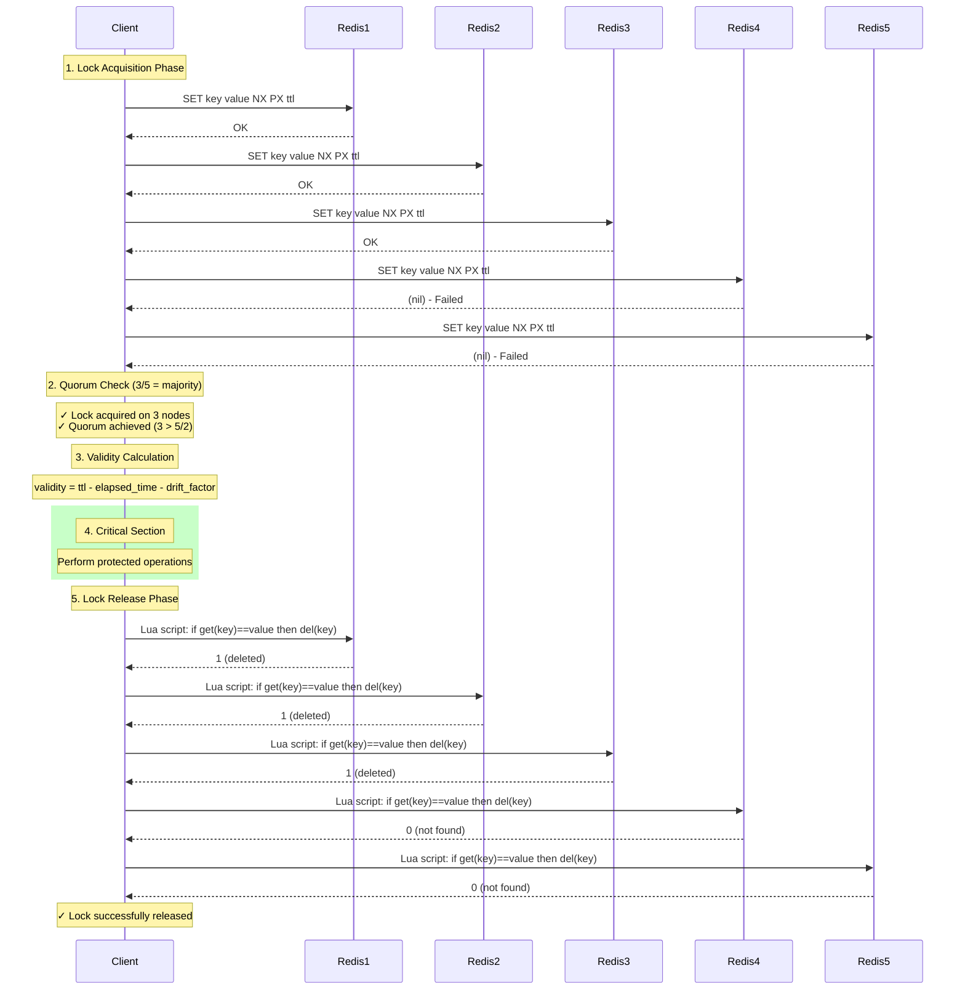

# Redlock4j

[](https://github.com/Codarama/redlock4j/actions/workflows/ci.yml)
[](https://maven-badges.herokuapp.com/maven-central/org.codarama/redlock4j)
[](https://javadoc.io/doc/org.codarama/redlock4j)
[](https://openjdk.java.net/)

> [!IMPORTANT]
> This project is a personal project and is not currently affiliated or endorsed in any way with Redis or any other company. Use the software freely and at your own risk.

A Java implementation of the [Redlock distributed locking algorithm](https://redis.io/docs/latest/develop/use/patterns/distributed-locks/) that implements the standard Java `java.util.concurrent.locks.Lock` interface.

## Features

- **Standard Java Lock Interface**: Implements `java.util.concurrent.locks.Lock` for seamless integration
- **Advanced Locking Primitives**: Fair locks, multi-locks, read-write locks, semaphores, and countdown latches
- **Asynchronous API**: CompletionStage-based async lock operations for non-blocking applications
- **RxJava Reactive API**: Full RxJava 3 reactive types (Single, Completable, Observable)
- **Lock Extension**: Extend lock validity time without releasing and re-acquiring
- **Multiple Redis Drivers**: Supports both Jedis and Lettuce Redis clients
- **Thread-Safe**: Proper thread-local lock state management
- **Fault Tolerant**: Works with Redis node failures as long as quorum is maintained
- **Configurable**: Customizable timeouts, retry logic, and clock drift compensation

## Requirements

- Java 8 or higher
- At least 3 Redis instances for proper Redlock operation
- Either Jedis or Lettuce Redis client library

## Dependencies

Add the following dependencies to your `pom.xml`:

```xml
<!-- For Jedis support -->
<dependency>
    <groupId>redis.clients</groupId>
    <artifactId>jedis</artifactId>
    <version>5.1.0</version>
</dependency>

<!-- OR for Lettuce support -->
<dependency>
    <groupId>io.lettuce</groupId>
    <artifactId>lettuce-core</artifactId>
    <version>6.7.1.RELEASE</version>
</dependency>

<!-- Logging -->
<dependency>
    <groupId>org.slf4j</groupId>
    <artifactId>slf4j-api</artifactId>
    <version>2.0.9</version>
</dependency>
```

## Quick Start

### 1. Add Dependencies

Add this library and your preferred Redis client to your `pom.xml`:

```xml
<!-- Redlock4j from Maven Central -->
<dependency>
    <groupId>org.codarama</groupId>
    <artifactId>redlock4j</artifactId>
    <version>1.0.0</version>
</dependency>

<!-- Choose either Jedis OR Lettuce -->
<dependency>
    <groupId>redis.clients</groupId>
    <artifactId>jedis</artifactId>
    <version>5.1.0</version>
</dependency>
<!-- OR -->
<dependency>
    <groupId>io.lettuce</groupId>
    <artifactId>lettuce-core</artifactId>
    <version>6.7.1.RELEASE</version>
</dependency>
```

### 2. Configure Redis Nodes

```java
RedlockConfiguration config = RedlockConfiguration.builder()
    .addRedisNode("redis1.example.com", 6379)
    .addRedisNode("redis2.example.com", 6379)
    .addRedisNode("redis3.example.com", 6379)
    .defaultLockTimeout(Duration.ofSeconds(30))
    .retryDelay(Duration.ofMillis(200))
    .maxRetryAttempts(3)
    .build();
```

### 3. Create RedlockManager

```java
// Using Jedis
try (RedlockManager redlockManager = RedlockManager.withJedis(config)) {
    // Use the manager...
}

// OR using Lettuce
try (RedlockManager redlockManager = RedlockManager.withLettuce(config)) {
    // Use the manager...
}
```

### 4. Use Distributed Locks

```java
Lock lock = redlockManager.createLock("my-resource-key");

// Standard Lock interface usage
lock.lock();
try {
    // Critical section
    performCriticalWork();
} finally {
    lock.unlock();
}

// Try lock with timeout
if (lock.tryLock(5, TimeUnit.SECONDS)) {
    try {
        // Critical section
        performCriticalWork();
    } finally {
        lock.unlock();
    }
} else {
    // Failed to acquire lock
    handleLockFailure();
}
```

## Advanced Locking Primitives

Redlock4j provides several advanced distributed synchronization primitives beyond basic locks.

### Fair Lock (FIFO Ordering)

Fair locks ensure that threads acquire locks in the order they requested them (FIFO).

```java
Lock fairLock = redlockManager.createFairLock("fair-resource");

fairLock.lock();
try {
    // Critical section - guaranteed FIFO ordering
    performWork();
} finally {
    fairLock.unlock();
}
```

### Multi-Lock (Atomic Multi-Resource Locking)

Multi-locks allow atomic acquisition of multiple resources, preventing deadlocks through consistent ordering.

```java
// Lock multiple resources atomically
Lock multiLock = redlockManager.createMultiLock(
    Arrays.asList("account:1", "account:2", "account:3")
);

multiLock.lock();
try {
    // All resources are now locked atomically
    transferBetweenAccounts();
} finally {
    multiLock.unlock();
}
```

### Read-Write Lock

Read-write locks allow multiple concurrent readers or a single exclusive writer.

```java
RedlockReadWriteLock rwLock = redlockManager.createReadWriteLock("shared-data");

// Multiple readers can access simultaneously
rwLock.readLock().lock();
try {
    readData();
} finally {
    rwLock.readLock().unlock();
}

// Writers get exclusive access
rwLock.writeLock().lock();
try {
    writeData();
} finally {
    rwLock.writeLock().unlock();
}
```

### Semaphore (Distributed Permits)

Semaphores control concurrent access with a configurable number of permits.

```java
// Create a semaphore with 5 permits
RedlockSemaphore semaphore = redlockManager.createSemaphore("api-limiter", 5);

if (semaphore.tryAcquire(5, TimeUnit.SECONDS)) {
    try {
        // One of 5 concurrent slots
        callRateLimitedAPI();
    } finally {
        semaphore.release();
    }
}
```

### CountDownLatch (Distributed Coordination)

Countdown latches allow threads to wait until a set of operations completes.

```java
// Create a latch that waits for 3 operations
RedlockCountDownLatch latch = redlockManager.createCountDownLatch("startup", 3);

// Worker threads count down
new Thread(() -> {
    initializeService1();
    latch.countDown();
}).start();

new Thread(() -> {
    initializeService2();
    latch.countDown();
}).start();

new Thread(() -> {
    initializeService3();
    latch.countDown();
}).start();

// Main thread waits for all
latch.await(); // Blocks until count reaches 0
System.out.println("All services initialized!");
```

## Asynchronous and Reactive APIs

Redlock4j provides modern asynchronous and reactive APIs for non-blocking applications.

### Asynchronous API (CompletionStage)

```java
// Create async lock
AsyncRedlock asyncLock = redlockManager.createAsyncLock("async-resource");

// Async lock acquisition
CompletionStage<Boolean> lockFuture = asyncLock.tryLockAsync();
lockFuture
    .thenAccept(acquired -> {
        if (acquired) {
            System.out.println("Lock acquired asynchronously!");
            // Perform async work
        }
    })
    .thenCompose(v -> asyncLock.unlockAsync())
    .thenRun(() -> System.out.println("Lock released!"));

// Async lock with timeout
asyncLock.tryLockAsync(Duration.ofSeconds(5))
    .thenAccept(acquired -> {
        // Handle result
    });
```

### RxJava Reactive API

```java
// Create RxJava reactive lock
RxRedlock rxLock = redlockManager.createRxLock("rxjava-resource");

// RxJava Single for lock acquisition
Single<Boolean> lockSingle = rxLock.tryLockRx();
lockSingle.subscribe(
    acquired -> System.out.println("Lock acquired: " + acquired),
    throwable -> System.err.println("Error: " + throwable.getMessage())
);

// RxJava Observable for validity monitoring
Observable<Long> validityObservable = rxLock.validityObservable(Duration.ofSeconds(1));
validityObservable
    .take(5)
    .subscribe(validityTime -> System.out.println("Lock valid for " + validityTime + "ms"));

// RxJava lock state monitoring
Observable<RxRedlock.LockState> stateObservable = rxLock.lockStateObservable();
stateObservable.subscribe(state -> System.out.println("Lock state: " + state));
```

### Combined Async/Reactive Lock

```java
// Lock implementing both AsyncRedlock and AsyncRedlockImpl interfaces
AsyncRxRedlock combinedLock = redlockManager.createAsyncRxLock("combined-resource");

// Use CompletionStage interface for acquisition
combinedLock.tryLockAsync()
    .thenAccept(acquired -> {
        if (acquired) {
            // Use RxJava interface for monitoring
            Observable<Long> validityObservable = combinedLock.validityObservable(Duration.ofMillis(500));
            validityObservable.take(3).subscribe(validity -> {
                System.out.println("Validity: " + validity + "ms");
            });
        }
    });
```

## Configuration Options

### RedlockConfiguration

| Option | Default | Description |
|--------|---------|-------------|
| `defaultLockTimeout` | 30 seconds | How long locks are held before auto-expiring |
| `retryDelay` | 200ms | Base delay between lock acquisition attempts |
| `maxRetryAttempts` | 3 | Maximum number of retry attempts |
| `clockDriftFactor` | 0.01 | Factor to account for clock drift between nodes |
| `lockAcquisitionTimeout` | 10 seconds | Maximum time to wait when calling `lock()` |

### RedisNodeConfiguration

| Option | Default | Description |
|--------|---------|-------------|
| `host` | localhost | Redis server hostname |
| `port` | 6379 | Redis server port |
| `password` | null | Redis password (if required) |
| `database` | 0 | Redis database number |
| `connectionTimeoutMs` | 2000 | Connection timeout in milliseconds |
| `socketTimeoutMs` | 2000 | Socket timeout in milliseconds |

## Advanced Usage

### Custom Node Configuration

```java
RedisNodeConfiguration node1 = RedisNodeConfiguration.builder()
    .host("redis1.example.com")
    .port(6379)
    .password("secret")
    .database(1)
    .connectionTimeoutMs(3000)
    .socketTimeoutMs(3000)
    .build();

RedlockConfiguration config = RedlockConfiguration.builder()
    .addRedisNode(node1)
    .addRedisNode("redis2.example.com", 6379, "secret")
    .addRedisNode("redis3.example.com", 6379, "secret")
    .build();
```

### Checking Lock State

```java
Redlock redlock = (Redlock) lock;

if (redlock.isHeldByCurrentThread()) {
    long remainingTime = redlock.getRemainingValidityTime();
    System.out.println("Lock valid for " + remainingTime + "ms more");
}
```

### Health Monitoring

```java
if (redlockManager.isHealthy()) {
    System.out.println("Manager has " + redlockManager.getConnectedNodeCount() +
                      " connected nodes (quorum: " + redlockManager.getQuorum() + ")");
} else {
    System.err.println("Not enough Redis nodes connected for reliable operation");
}
```

### Lock Extension

Extend the validity time of an already-acquired lock without releasing it:

```java
// Synchronous
Redlock lock = manager.createLock("my-resource");
if (lock.tryLock()) {
    try {
        // Do some work...

        // Need more time? Extend the lock by 10 seconds
        boolean extended = lock.extend(10000);
        if (extended) {
            // Continue working with extended lock
        } else {
            // Extension failed - handle gracefully
        }
    } finally {
        lock.unlock();
    }
}

// Asynchronous
AsyncRedlock asyncLock = manager.createAsyncLock("my-resource");
asyncLock.tryLockAsync()
    .thenCompose(acquired -> {
        if (!acquired) return CompletableFuture.completedFuture(false);

        // Do async work, then extend
        return asyncLock.extendAsync(Duration.ofSeconds(10));
    })
    .whenComplete((extended, error) -> asyncLock.unlockAsync());

// Reactive
RxRedlock rxLock = manager.createRxLock("my-resource");
rxLock.tryLockRx()
    .filter(acquired -> acquired)
    .flatMap(acquired -> rxLock.extendRx(Duration.ofSeconds(10)))
    .doFinally(() -> rxLock.unlockRx().subscribe())
    .subscribe();
```

**Important:** Lock extension is for efficiency, not correctness. It does not solve GC pause problems. For true correctness, use fencing tokens. See [Lock Extension Documentation](docs/LOCK-EXTENSION.md) for details.

## How It Works

This implementation follows the Redlock algorithm as specified by Redis. The diagram below illustrates the complete flow:



### Algorithm Steps:

1. **Lock Acquisition**: Attempts to acquire the lock on all Redis nodes sequentially
2. **Quorum Check**: Requires majority of nodes (N/2+1) to successfully acquire the lock
3. **Validity Calculation**: Accounts for time elapsed and clock drift when determining lock validity
4. **Automatic Cleanup**: Releases partial locks if quorum is not achieved
5. **Safe Release**: Uses Lua script to ensure only the lock holder can release the lock

## Thread Safety

- Each thread maintains its own lock state using `ThreadLocal`
- Multiple threads can safely use the same `Redlock` instance
- Lock state is automatically cleaned up when locks are released

## Error Handling

- `RedlockException`: Thrown for lock-related errors
- `RedisDriverException`: Thrown for Redis communication errors
- Automatic retry with exponential backoff and jitter
- Graceful degradation when Redis nodes are unavailable

## Best Practices

1. **Use at least 3 Redis nodes** for proper fault tolerance
2. **Set appropriate timeouts** based on your use case
3. **Always use try-finally blocks** to ensure locks are released
4. **Monitor Redis node health** and connection status
5. **Consider lock validity time** for long-running operations
6. **Use unique lock keys** to avoid conflicts between different resources

## CI/CD and Testing

This project uses GitHub Actions for continuous integration and comprehensive testing:

### Automated Testing
- **Pull Request Validation**: Every PR is automatically tested with compilation, unit tests, and integration tests
- **Nightly Comprehensive Tests**: Full test suite including performance tests runs every night
- **Multi-Platform Testing**: Tests run on Ubuntu, Windows, and macOS
- **Multi-Java Version**: Tested against Java 8, 11, 17, and 21
- **Multi-Redis Version**: Tested against Redis 6, 7, and latest versions

### Security and Quality
- **Dependency Security Scanning**: OWASP dependency check for known vulnerabilities
- **Code Coverage**: JaCoCo integration for test coverage reporting
- **License Compliance**: Automated verification of license headers
- **Code Style**: Basic formatting and style checks

### Workflows
- **CI Workflow** (`.github/workflows/ci.yml`): Runs on every push and PR
- **Nightly Workflow** (`.github/workflows/nightly.yml`): Comprehensive testing every night
- **PR Validation** (`.github/workflows/pr-validation.yml`): Detailed PR validation with comments
- **Release Workflow** (`.github/workflows/release.yml`): Automated Maven Central publishing

### Running Tests Locally
```bash
# Run all tests
mvn test

# Run only unit tests
mvn test -Dtest=RedlockConfigurationTest

# Run only integration tests
mvn test -Dtest=RedlockIntegrationTest

# Run with coverage
mvn test jacoco:report

# Security scan
mvn org.owasp:dependency-check-maven:check
```

## Releases and Maven Central

Redlock4j is automatically published to Maven Central when new GitHub releases are created.

### Latest Release

The latest stable version is available on Maven Central:

**Maven:**
```xml
<dependency>
    <groupId>org.codarama</groupId>
    <artifactId>redlock4j</artifactId>
    <version>1.0.0</version>
</dependency>
```

**Gradle:**
```gradle
implementation 'org.codarama:redlock4j:1.0.0'
```

### Related Documentation
- [How to do distributed locking](https://martin.kleppmann.com/2016/02/08/how-to-do-distributed-locking.html) by Martin Kleppmann
- [Is Redlock safe?](https://antirez.com/news/101) bt Salvatore Sanfilippo
- [Locks, leases, fencing tokens, FizzBee!](https://surfingcomplexity.blog/2025/03/03/locks-leases-fencing-tokens-fizzbee/) by Lorin Hochstein

## License

This project is licensed under the MIT License - see the [LICENSE](LICENSE) file for details.

Copyright (c) 2025 Codarama
